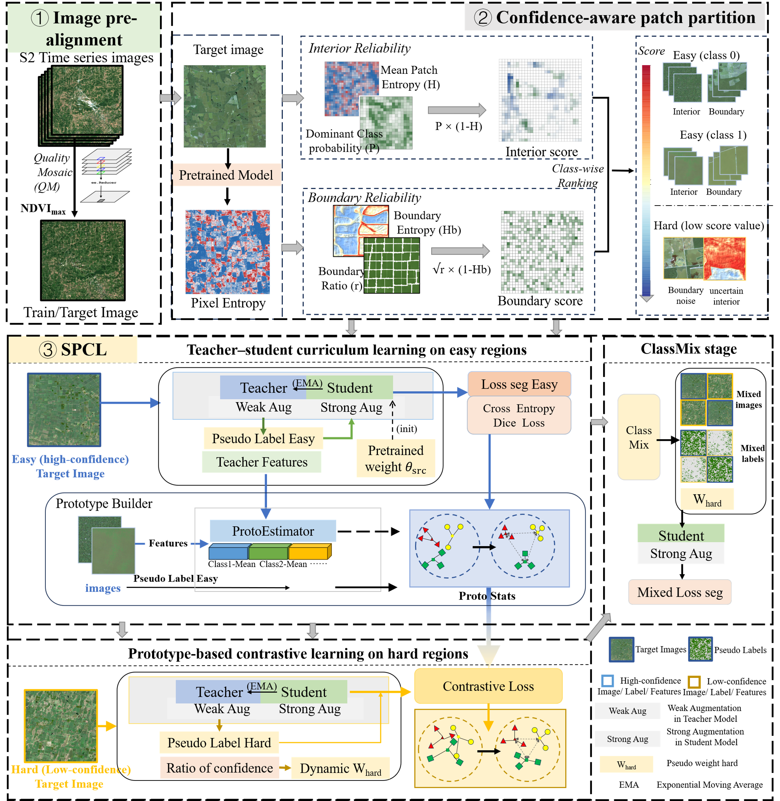

# CROPS: Source-Free UDA for in-season Crop-Type Semantic Segmentation

This repository is the project page for **CROPS**, a source-free unsupervised domain adaptation (SF-UDA) framework for satellite-image crop-type semantic segmentation. CROPS first trains a segmentation model on a labeled source domain and then adapts it to an unlabeled target domain using only pretrained parameters and target images. Source images and source labels are not used during adaptation.

## Paper

**A Source-Free Unsupervised Domain Adaptation Framework for Large-scale, in-season Soybean Mapping**  
ISPRS Journal of Photogrammetry and Remote Sensing, 2026

Full citation metadata and BibTeX will be added when the final publication record is available.

## Code Release Status

The full code release has **not yet been published**. This repository is currently being prepared for the public release of the CROPS implementation.

The release package is still under organization and documentation, and the complete reproducible workflow will take some additional time to finalize. Scripts, configuration files, pretrained model handling, data preparation instructions, experiment commands, inference utilities, and usage notes may still be adjusted before the official public release.

At this stage, the repository should be treated as a preliminary project page rather than a complete plug-and-play reproduction package.

## Method Overview

CROPS combines three components:

**Image pre-alignment (NDVI-QM).** Each domain is converted to an NDVI-based quality mosaic that emphasizes peak vegetation conditions and suppresses low-quality observations, providing a stabilized representation for downstream segmentation.

**Confidence-aware easy/hard patch partition.** A source-pretrained model infers class probabilities and uncertainty on the target composite. Target patches are split into easy high-confidence and hard low-confidence subsets to form an explicit easy-to-hard curriculum.

**Semantic Prototypical Contrastive Learning (SPCL).** Adaptation is performed in a teacher-student EMA framework. Class prototypes are estimated from easy regions and used as semantic anchors. Hard-region features are aligned to these prototypes via prototype-based contrastive learning, coupled with confidence-weighted ClassMix supervision.

SPCL is backbone-agnostic. This repository provides an instantiation with TransUNet, and the same SPCL module can be integrated with other semantic segmentation backbones.

## Planned Implementation Scope

The full release is designed around the SPCL adaptation workflow for binary soybean mapping from Sentinel-2 composite blocks. The planned release will include:

- NDVI-QM composite preparation interface.
- Confidence-aware easy/hard target patch partition.
- SPCL adaptation with a teacher-student EMA design.
- TransUNet-based semantic segmentation backbone.
- HDF5 target-block loading.
- Tiled GeoTIFF inference.
- Artifact inspection utilities.
- Reproducible experiment configuration and command-line usage.

## Target Application

- **Task:** binary in-season soybean mapping.
- **Input representation:** Sentinel-2 peak-season composite blocks.
- **Adaptation setting:** source-free unsupervised domain adaptation.
- **Backbone implementation:** TransUNet.
- **Core adaptation module:** SPCL.
- **Target curriculum:** confidence-aware easy/hard partition.
- **Inference mode:** tiled semantic segmentation map generation.

## Release Plan

The official code release will provide:

- Environment requirements.
- Data preparation instructions.
- Pretrained source-model handling.
- Reproducible adaptation workflow.
- Evaluation and inference instructions.
- Citation and license information.

Usage examples and exact experiment commands will be added after the public release package is finalized.
